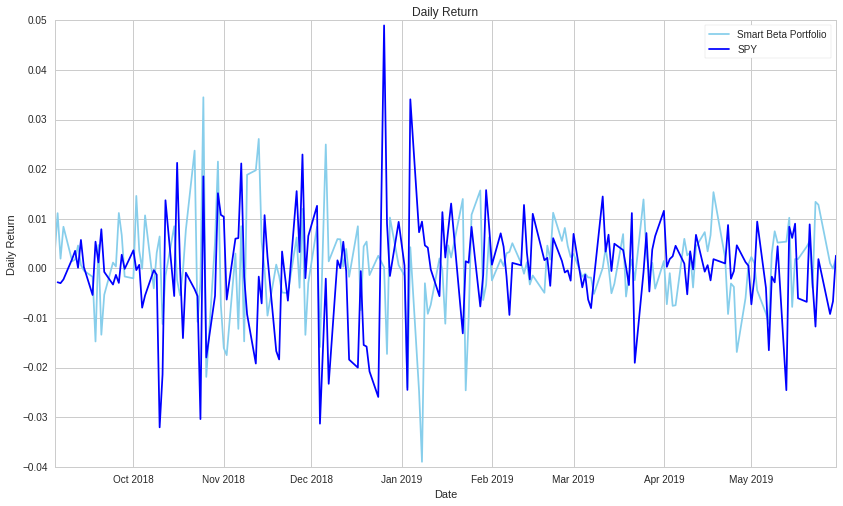
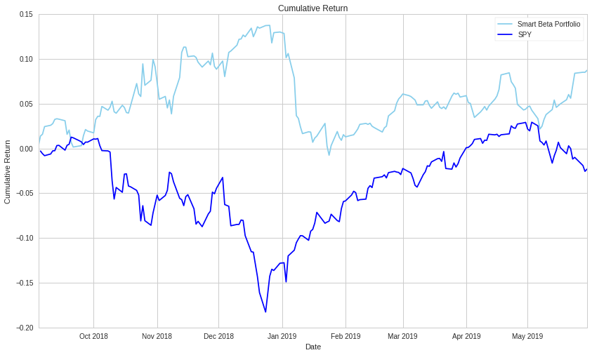

# MAFS6010U-final-project
## Code: Smart Beta Trading Strategy Based on Fundamental Factors

This is the code for our final project. In this project, we built our Smart Beta Trading Strategy based on fundamental factors. First let me show you how to run our code.

### How to run the code?

Our smart beta trading strategy is based on the Quantopian platform. To run our code, the first to use Quantopian platform: https://www.quantopian.com. Upload the 'code.ipynb' file in Quantopian-Research-Notebooks, and then you can run the code and get our results

### Code


```python
import pandas as pd
import numpy as np
from quantopian.pipeline import Pipeline
from quantopian.pipeline.data.factset import Fundamentals
from quantopian.pipeline.factors import CustomFactor, Returns, Latest
from quantopian.pipeline.classifiers import Classifier
from quantopian.pipeline.filters import Q500US
from quantopian.research import run_pipeline
import matplotlib.pyplot as plt

class Momentum(CustomFactor):
    
    inputs = [Returns(window_length=10)]
    window_length = 10
    
    def compute(self, today, assets, out, lag_returns):
        out[:] = lag_returns[0]


def make_pipeline():
    # define our fundamental factor pipeline
    pipe = Pipeline()
    
    # market value,book_to_market,return_on_equity and reinvestment_rate data gets fed in here
    market_value = Latest([Fundamentals.mkt_val]) 
    book_to_market = 1/Latest([Fundamentals.pbk_af]) 
    return_on_equity=Latest([Fundamentals.roe_af]) 
    reinvestment_rate=Fundamentals.reinvest_rate_af.latest 
                             
    # and momentum as lagged returns 
    momentum = Momentum() 
    
    # we also get daily returns
    returns = Returns(window_length=2)
    
    # we compute a daily rank of all factors, this is used in the next step,
    # which is computing portfolio membership QTradableStocksUS
    market_value_rank = market_value.rank(mask=Q500US())
    book_to_market_rank = book_to_market.rank(mask=Q500US())
    return_on_equity_rank= return_on_equity.rank(mask=Q500US())
    reinvestment_rate_rank=reinvestment_rate.rank(mask=Q500US())
    momentum_rank = momentum.rank(mask=Q500US())
    
    # Grab the top and bottom 50 for each factor
    biggest = market_value_rank.top(50)
    smallest = market_value_rank.bottom(50)
    
    highpb = book_to_market_rank.top(50)
    lowpb = book_to_market_rank.bottom(50)
    
    robust = return_on_equity_rank.top(50)
    weak = return_on_equity_rank.bottom(50)
    
    conservative = reinvestment_rate_rank.top(50)
    aggressive = reinvestment_rate_rank.bottom(50)
    
    top = momentum_rank.top(50)
    bottom = momentum_rank.bottom(50)
    
    
    # Define our universe, screening out anything that isn't in the top or bottom 50 for each factor
    universe = Q500US() & (biggest | smallest | highpb | lowpb | top | bottom | robust |
                                     weak | conservative | aggressive)
    
    pipe = Pipeline(
        columns = {
            'market_value':market_value,
            'book_to_market':book_to_market,
            'return_on_equity':return_on_equity,
            'reinvestment_rate':reinvestment_rate,
            'momentum':momentum,
            'Returns':returns,
            'market_value_rank':market_value_rank,
            'book_to_market_rank':book_to_market_rank,
            'return_on_equity_rank':return_on_equity_rank,
            'reinvestment_rate_rank':reinvestment_rate_rank,
            'momentum_rank':momentum_rank,
            'biggest':biggest,
            'smallest':smallest,
            'highpb':highpb,
            'lowpb':lowpb,
            'top':top,
            'bottom':bottom,
            'robust':robust,
            'weak':weak,
            'conservative':conservative,
            'aggressive':aggressive
        },
        screen=universe
    )
    
    return pipe

# Initializing the pipe
pipe = make_pipeline()

# Now let's start the pipeline
start_date, end_date = '2018-01-01', '2018-12-30' 

results = run_pipeline(pipe, start_date, end_date)

results.head()
```


    


<b>Pipeline Execution Time:</b> 3.96 Seconds


<div>
<table border="1" class="dataframe">
  <thead>
    <tr style="text-align: right;">
      <th></th>
      <th></th>
      <th>Returns</th>
      <th>aggressive</th>
      <th>biggest</th>
      <th>book_to_market</th>
      <th>book_to_market_rank</th>
      <th>bottom</th>
      <th>conservative</th>
      <th>highpb</th>
      <th>lowpb</th>
      <th>market_value</th>
      <th>...</th>
      <th>momentum</th>
      <th>momentum_rank</th>
      <th>reinvestment_rate</th>
      <th>reinvestment_rate_rank</th>
      <th>return_on_equity</th>
      <th>return_on_equity_rank</th>
      <th>robust</th>
      <th>smallest</th>
      <th>top</th>
      <th>weak</th>
    </tr>
  </thead>
  <tbody>
    <tr>
      <th rowspan="5" valign="top">2018-01-02 00:00:00+00:00</th>
      <th>Equity(24 [AAPL])</th>
      <td>-0.010347</td>
      <td>False</td>
      <td>True</td>
      <td>0.169669</td>
      <td>127.0</td>
      <td>False</td>
      <td>False</td>
      <td>False</td>
      <td>False</td>
      <td>7.900500e+11</td>
      <td>...</td>
      <td>0.023908</td>
      <td>346.0</td>
      <td>27.131180</td>
      <td>432.0</td>
      <td>36.867508</td>
      <td>430.0</td>
      <td>False</td>
      <td>False</td>
      <td>False</td>
      <td>False</td>
    </tr>
    <tr>
      <th>Equity(67 [ADSK])</th>
      <td>-0.002094</td>
      <td>False</td>
      <td>False</td>
      <td>0.040939</td>
      <td>25.0</td>
      <td>False</td>
      <td>False</td>
      <td>False</td>
      <td>True</td>
      <td>2.752450e+10</td>
      <td>...</td>
      <td>0.004169</td>
      <td>240.0</td>
      <td>10.630241</td>
      <td>290.0</td>
      <td>-49.473058</td>
      <td>21.0</td>
      <td>False</td>
      <td>False</td>
      <td>False</td>
      <td>True</td>
    </tr>
    <tr>
      <th>Equity(185 [AFL])</th>
      <td>-0.004421</td>
      <td>False</td>
      <td>False</td>
      <td>0.725168</td>
      <td>444.0</td>
      <td>False</td>
      <td>False</td>
      <td>True</td>
      <td>False</td>
      <td>3.205750e+10</td>
      <td>...</td>
      <td>0.012708</td>
      <td>286.0</td>
      <td>10.479183</td>
      <td>287.0</td>
      <td>13.925111</td>
      <td>257.0</td>
      <td>False</td>
      <td>False</td>
      <td>False</td>
      <td>False</td>
    </tr>
    <tr>
      <th>Equity(216 [HES])</th>
      <td>-0.018809</td>
      <td>True</td>
      <td>False</td>
      <td>0.737110</td>
      <td>447.0</td>
      <td>True</td>
      <td>False</td>
      <td>True</td>
      <td>False</td>
      <td>1.489950e+10</td>
      <td>...</td>
      <td>-0.062591</td>
      <td>25.0</td>
      <td>-38.461085</td>
      <td>33.0</td>
      <td>-36.155660</td>
      <td>26.0</td>
      <td>False</td>
      <td>False</td>
      <td>False</td>
      <td>True</td>
    </tr>
    <tr>
      <th>Equity(239 [AIG])</th>
      <td>-0.006668</td>
      <td>False</td>
      <td>False</td>
      <td>1.173749</td>
      <td>485.0</td>
      <td>False</td>
      <td>False</td>
      <td>True</td>
      <td>False</td>
      <td>5.518220e+10</td>
      <td>...</td>
      <td>0.007564</td>
      <td>262.0</td>
      <td>-2.568120</td>
      <td>113.0</td>
      <td>-0.914689</td>
      <td>85.0</td>
      <td>False</td>
      <td>False</td>
      <td>False</td>
      <td>False</td>
    </tr>
  </tbody>
</table>
<p>5 rows × 21 columns</p>
</div>


In the next part we will use Research to explore Quantopian's datasets. Then, we will define our trading strategy and test the return of our strategy compared to the SPY based on historical data. 


```python
# group_by(level=0).mean() gives you the average return of each day for a particular group of stocks
R_biggest = results[results.biggest]['Returns'].groupby(level=0).mean()
R_smallest = results[results.smallest]['Returns'].groupby(level=0).mean()

R_highpb = results[results.highpb]['Returns'].groupby(level=0).mean()
R_lowpb = results[results.lowpb]['Returns'].groupby(level=0).mean()

R_robust = results[results.robust]['Returns'].groupby(level=0).mean()
R_weak = results[results.weak]['Returns'].groupby(level=0).mean()

R_conservative = results[results.conservative]['Returns'].groupby(level=0).mean()
R_aggressive = results[results.aggressive]['Returns'].groupby(level=0).mean()

R_top = results[results.top]['Returns'].groupby(level=0).mean()
R_bottom = results[results.bottom]['Returns'].groupby(level=0).mean()

# risk-free proxy
R_F = get_pricing('BIL', fields='price', start_date=start_date, end_date=end_date).pct_change()[1:]

# find it's beta against market
M = get_pricing('SPY', start_date=start_date, end_date=end_date, fields='price').pct_change()[1:]

# Defining our final factors
EXMRKT = M - R_F
SMB = R_smallest - R_biggest # small minus big
HML = R_highpb - R_lowpb # high minus low
RMW = R_robust - R_weak # robust minus weak
CMA = R_conservative - R_aggressive #conservative - aggressive
MOM = R_top - R_bottom # momentum

plt.plot(SMB.index, SMB.values)
plt.ylabel('Daily Percent Return')
plt.legend(['SMB Portfolio Returns']);
SMB.head()
```


    2018-01-02 00:00:00+00:00   -0.005266
    2018-01-03 00:00:00+00:00    0.015987
    2018-01-04 00:00:00+00:00    0.004424
    2018-01-05 00:00:00+00:00   -0.006786
    2018-01-08 00:00:00+00:00   -0.007564
    Freq: C, Name: Returns, dtype: float64


```python
plt.plot(HML.index, HML.values)
plt.ylabel('Daily Percent Return')
plt.legend(['HML Portfolio Returns']);
HML.head()
```


    2018-01-02 00:00:00+00:00   -0.002241
    2018-01-03 00:00:00+00:00    0.007076
    2018-01-04 00:00:00+00:00   -0.001756
    2018-01-05 00:00:00+00:00    0.007322
    2018-01-08 00:00:00+00:00   -0.006643
    Freq: C, Name: Returns, dtype: float64


```python
plt.plot(RMW.index, RMW.values)
plt.ylabel('Daily Percent Return')
plt.legend(['RMW Portfolio Returns']);
RMW.head()
```


    2018-01-02 00:00:00+00:00    0.003904
    2018-01-03 00:00:00+00:00   -0.017103
    2018-01-04 00:00:00+00:00   -0.010280
    2018-01-05 00:00:00+00:00   -0.004531
    2018-01-08 00:00:00+00:00    0.006592
    Freq: C, Name: Returns, dtype: float64


```python
plt.plot(CMA.index, CMA.values)
plt.ylabel('Daily Percent Return')
plt.legend(['CMA Portfolio Returns']);
CMA.head()
```


    2018-01-02 00:00:00+00:00    0.002487
    2018-01-03 00:00:00+00:00   -0.006995
    2018-01-04 00:00:00+00:00   -0.004156
    2018-01-05 00:00:00+00:00    0.000724
    2018-01-08 00:00:00+00:00    0.006515
    Freq: C, Name: Returns, dtype: float64


```python
plt.plot(MOM.index, MOM.values)
plt.ylabel('Daily Percent Return')
plt.legend(['MOM Portfolio Returns']);
CMA.head()
```


    2018-01-02 00:00:00+00:00    0.002487
    2018-01-03 00:00:00+00:00   -0.006995
    2018-01-04 00:00:00+00:00   -0.004156
    2018-01-05 00:00:00+00:00    0.000724
    2018-01-08 00:00:00+00:00    0.006515
    Freq: C, Name: Returns, dtype: float64


```python
import empyrical as ep #calculate the cumulative return
cum_return_HML=ep.cum_returns(HML)
cum_return_SMB=ep.cum_returns(SMB)
cum_return_RMW=ep.cum_returns(RMW)
cum_return_CMA=ep.cum_returns(CMA)
cum_return_MOM=ep.cum_returns(MOM)
pd.DataFrame({   
    'HML': cum_return_HML,
    'SMB': cum_return_SMB,
    'RMW': cum_return_RMW,
    'CMA': cum_return_CMA,
    'MOM': cum_return_MOM,
}).plot(
    title='Cumulative Returns'
);
```


```python
import pyfolio as pf
benchmark_rets = pf.utils.get_symbol_rets('SPY')
pf.plotting.show_perf_stats(MOM, benchmark_rets)
```


<table border="1" class="dataframe">
  <thead>
    <tr style="text-align: right;"><th>Start date</th><td colspan=2>2018-01-02</td></tr>
    <tr style="text-align: right;"><th>End date</th><td colspan=2>2018-12-31</td></tr>
    <tr style="text-align: right;"><th>Total months</th><td colspan=2>11</td></tr>
    <tr style="text-align: right;">
      <th></th>
      <th>Backtest</th>
    </tr>
  </thead>
  <tbody>
    <tr>
      <th>Annual return</th>
      <td>8.783%</td>
    </tr>
    <tr>
      <th>Cumulative returns</th>
      <td>8.746%</td>
    </tr>
    <tr>
      <th>Annual volatility</th>
      <td>15.641%</td>
    </tr>
    <tr>
      <th>Sharpe ratio</th>
      <td>0.62</td>
    </tr>
    <tr>
      <th>Calmar ratio</th>
      <td>0.84</td>
    </tr>
    <tr>
      <th>Stability</th>
      <td>0.10</td>
    </tr>
    <tr>
      <th>Max drawdown</th>
      <td>-10.464%</td>
    </tr>
    <tr>
      <th>Omega ratio</th>
      <td>1.11</td>
    </tr>
    <tr>
      <th>Sortino ratio</th>
      <td>0.93</td>
    </tr>
    <tr>
      <th>Skew</th>
      <td>0.45</td>
    </tr>
    <tr>
      <th>Kurtosis</th>
      <td>3.29</td>
    </tr>
    <tr>
      <th>Tail ratio</th>
      <td>0.97</td>
    </tr>
    <tr>
      <th>Daily value at risk</th>
      <td>-1.932%</td>
    </tr>
    <tr>
      <th>Alpha</th>
      <td>0.10</td>
    </tr>
    <tr>
      <th>Beta</th>
      <td>0.03</td>
    </tr>
  </tbody>
</table>


```python
import itertools
import statsmodels.api as sm
from statsmodels import regression,stats
import scipy

data = results[['Returns']].set_index(results.index)
asset_list_sizes = [group[1].size for group in data.groupby(level=0)]

# Spreading the factor portfolio data across all assets for each day
SMB_column = [[SMB.loc[group[0]]] * size for group, size \
              in zip(data.groupby(level=0), asset_list_sizes)]
data['SMB'] = list(itertools.chain(*SMB_column))

HML_column = [[HML.loc[group[0]]] * size for group, size \
              in zip(data.groupby(level=0), asset_list_sizes)]
data['HML'] = list(itertools.chain(*HML_column))

MOM_column = [[MOM.loc[group[0]]] * size for group, size \
              in zip(data.groupby(level=0), asset_list_sizes)]
data['MOM'] = list(itertools.chain(*MOM_column))

CMA_column = [[CMA.loc[group[0]]] * size for group, size \
              in zip(data.groupby(level=0), asset_list_sizes)]
data['CMA'] = list(itertools.chain(*CMA_column))

RMW_column = [[RMW.loc[group[0]]] * size for group, size \
              in zip(data.groupby(level=0), asset_list_sizes)]
data['RMW'] = list(itertools.chain(*RMW_column))

EXMRKT_column = [[EXMRKT.loc[group[0]]]*size if group[0] in EXMRKT.index else [None]*size \
                 for group, size in zip(data.groupby(level=0), asset_list_sizes)]

data['EXMRKT'] = list(itertools.chain(*EXMRKT_column))

data = sm.add_constant(data.dropna())

# Our list of assets from pipeline
assets = data.index.levels[1].unique()

# gathering our data to be asset-specific
Y = [data.xs(asset, level=1)['Returns'] for asset in assets] 
X = [data.xs(asset, level=1)[['EXMRKT','SMB', 'HML', 'MOM','RMW','CMA', 'const']] for asset in assets]

# First regression step: estimating the betas
reg_results = [regression.linear_model.OLS(y, x).fit().params \
               for y, x in zip(Y, X) if not(x.empty or y.empty)]
indices = [asset for y, x, asset in zip(Y, X, assets) if not(x.empty or y.empty)]

betas = pd.DataFrame(reg_results, index=indices)
betas = sm.add_constant(betas.drop('const', axis=1))

R = data['Returns'].mean(axis=0, level=1)

# Second regression step: estimating the risk premia
risk_free_rate = np.mean(R_F)

final_results = regression.linear_model.OLS(R - risk_free_rate, betas).fit()

final_results.summary()
```


<table class="simpletable">
<caption>OLS Regression Results</caption>
<tr>
  <th>Dep. Variable:</th>         <td>Returns</td>     <th>  R-squared:         </th> <td>   0.069</td>
</tr>
<tr>
  <th>Model:</th>                   <td>OLS</td>       <th>  Adj. R-squared:    </th> <td>   0.059</td>
</tr>
<tr>
  <th>Method:</th>             <td>Least Squares</td>  <th>  F-statistic:       </th> <td>   6.987</td>
</tr>
<tr>
  <th>Date:</th>             <td>Sun, 31 May 2020</td> <th>  Prob (F-statistic):</th> <td>3.50e-07</td>
</tr>
<tr>
  <th>Time:</th>                 <td>15:15:52</td>     <th>  Log-Likelihood:    </th> <td>  2625.3</td>
</tr>
<tr>
  <th>No. Observations:</th>      <td>   572</td>      <th>  AIC:               </th> <td>  -5237.</td>
</tr>
<tr>
  <th>Df Residuals:</th>          <td>   565</td>      <th>  BIC:               </th> <td>  -5206.</td>
</tr>
<tr>
  <th>Df Model:</th>              <td>     6</td>      <th>                     </th>     <td> </td>   
</tr>
<tr>
  <th>Covariance Type:</th>      <td>nonrobust</td>    <th>                     </th>     <td> </td>   
</tr>
</table>
<table class="simpletable">
<tr>
     <td></td>       <th>coef</th>     <th>std err</th>      <th>t</th>      <th>P>|t|</th> <th>[95.0% Conf. Int.]</th> 
</tr>
<tr>
  <th>const</th>  <td> -8.07e-05</td> <td>    0.000</td> <td>   -0.526</td> <td> 0.599</td> <td>   -0.000     0.000</td>
</tr>
<tr>
  <th>EXMRKT</th> <td>   -0.0003</td> <td>    0.000</td> <td>   -1.179</td> <td> 0.239</td> <td>   -0.001     0.000</td>
</tr>
<tr>
  <th>SMB</th>    <td>   -0.0005</td> <td>    0.000</td> <td>   -3.319</td> <td> 0.001</td> <td>   -0.001    -0.000</td>
</tr>
<tr>
  <th>HML</th>    <td>-3.143e-05</td> <td>    0.000</td> <td>   -0.202</td> <td> 0.840</td> <td>   -0.000     0.000</td>
</tr>
<tr>
  <th>MOM</th>    <td>    0.0008</td> <td>    0.000</td> <td>    4.776</td> <td> 0.000</td> <td>    0.000     0.001</td>
</tr>
<tr>
  <th>RMW</th>    <td>    0.0005</td> <td>    0.000</td> <td>    3.454</td> <td> 0.001</td> <td>    0.000     0.001</td>
</tr>
<tr>
  <th>CMA</th>    <td>    0.0004</td> <td>    0.000</td> <td>    3.537</td> <td> 0.000</td> <td>    0.000     0.001</td>
</tr>
</table>
<table class="simpletable">
<tr>
  <th>Omnibus:</th>       <td>105.450</td> <th>  Durbin-Watson:     </th> <td>   2.058</td>
</tr>
<tr>
  <th>Prob(Omnibus):</th> <td> 0.000</td>  <th>  Jarque-Bera (JB):  </th> <td>1543.952</td>
</tr>
<tr>
  <th>Skew:</th>          <td> 0.276</td>  <th>  Prob(JB):          </th> <td>    0.00</td>
</tr>
<tr>
  <th>Kurtosis:</th>      <td>11.030</td>  <th>  Cond. No.          </th> <td>    8.84</td>
</tr>
</table>


```python
#hedge
# we'll take a random sample of 200 assets from QTradableStocksUS in order to build a random portfolio
random_assets = list(np.random.choice(assets, size=200, replace=False))

portfolio_data = data[data.index.isin(random_assets, level=1)]

# this is the return of our portfolio with no hedging
R_portfolio_time_series = portfolio_data['Returns'].mean(level=0)

# next, we calculate the exposure of our portfolio to each of the Fama-French factors
portfolio_exposure = regression.linear_model.OLS(portfolio_data['Returns'], \
                                portfolio_data[['EXMRKT', 'SMB', 'HML', 'MOM','RMW','CMA','const']]).fit()

print portfolio_exposure.summary()

# our hedged return stream
hedged_portfolio = R_portfolio_time_series - \
                portfolio_exposure.params[0]*EXMRKT - \
                portfolio_exposure.params[1]*SMB - \
                portfolio_exposure.params[2]*HML - \
                portfolio_exposure.params[3]*RMW - \
                portfolio_exposure.params[4]*CMA - \
                portfolio_exposure.params[5]*MOM 

print 'Mean, Std of Hedged Portfolio:', np.mean(hedged_portfolio), np.std(hedged_portfolio)
print 'Mean, Std of Unhedged Portfolio:', np.mean(R_portfolio_time_series), np.std(R_portfolio_time_series)
```

                                OLS Regression Results                            
    ==============================================================================
    Dep. Variable:                Returns   R-squared:                       0.094
    Model:                            OLS   Adj. R-squared:                  0.094
    Method:                 Least Squares   F-statistic:                     396.0
    Date:                Sun, 31 May 2020   Prob (F-statistic):               0.00
    Time:                        15:15:52   Log-Likelihood:                 54501.
    No. Observations:               22835   AIC:                        -1.090e+05
    Df Residuals:                   22828   BIC:                        -1.089e+05
    Df Model:                           6                                         
    Covariance Type:            nonrobust                                         
    ==============================================================================
                     coef    std err          t      P>|t|      [95.0% Conf. Int.]
    ------------------------------------------------------------------------------
    EXMRKT        -0.0196      0.014     -1.408      0.159        -0.047     0.008
    SMB            0.2250      0.020     11.102      0.000         0.185     0.265
    HML           -0.1383      0.017     -8.269      0.000        -0.171    -0.106
    MOM           -0.0591      0.016     -3.785      0.000        -0.090    -0.029
    RMW           -1.2047      0.041    -29.320      0.000        -1.285    -1.124
    CMA            0.9803      0.048     20.608      0.000         0.887     1.074
    const      -3.652e-05      0.000     -0.246      0.805        -0.000     0.000
    ==============================================================================
    Omnibus:                     8075.530   Durbin-Watson:                   1.655
    Prob(Omnibus):                  0.000   Jarque-Bera (JB):          2195352.100
    Skew:                           0.410   Prob(JB):                         0.00
    Kurtosis:                      51.028   Cond. No.                         412.
    ==============================================================================
    
    Warnings:
    [1] Standard Errors assume that the covariance matrix of the errors is correctly specified.
    Mean, Std of Hedged Portfolio: -0.0004526138853038367 0.015226820079955539
    Mean, Std of Unhedged Portfolio: -0.00040619188376982704 0.01141073648785565


```python
# testing for normality: jarque-bera
_, pvalue_JB, _, _ = stats.stattools.jarque_bera(portfolio_exposure.resid)
print "Jarque-Bera p-value: ", pvalue_JB

# testing for homoskedasticity: breush pagan
_, pvalue_BP, _, _ = stats.diagnostic.het_breushpagan(portfolio_exposure.resid, \
                                            portfolio_data[['EXMRKT', 'SMB', 'HML', 'MOM','CMA','RMW','const']])
print "Breush Pagan p-value: ", pvalue_BP

# testing for autocorrelation
dw = stats.stattools.durbin_watson(portfolio_exposure.resid)
print "Durbin Watson statistic: ", dw
```

    Jarque-Bera p-value:  0.0
    Breush Pagan p-value:  0.0116048569218
    Durbin Watson statistic:  1.65463567418


```python
from quantopian.pipeline.filters import Q1500US

class Momentum(CustomFactor):
    
    inputs = [Returns(window_length=10)]
    window_length = 10
    
    def compute(self, today, assets, out, lag_returns):
        out[:] = lag_returns[0]

def make_pipeline():
    # define our fundamental factor pipeline
    pipe = Pipeline()
    
    return_on_equity=Latest([Fundamentals.roe_af]) 
    reinvestment_rate=Fundamentals.reinvest_rate_af.latest 
    momentum = Momentum() 

    
   #do standardization
    return_on_equity=return_on_equity.zscore()
    reinvestment_rate=reinvestment_rate.zscore()
    momentum=momentum.zscore()
    total_z= 0.34*return_on_equity+0.16*reinvestment_rate+0.5*momentum
    
    # we also get daily returns
    returns = Returns(window_length=2)
    
    # we compute a daily rank of both factors, this is used in the next step,
    # which is computing portfolio membership QTradableStocksUS
    total_z_rank = total_z.rank(mask=Q1500US())
    
    buy = total_z_rank.top(200)
    sell = total_z_rank.bottom(200)
    
    # Define our universe, screening out anything that isn't in the top or bottom 200
    universe = Q1500US() & (buy | sell)
    
    pipe = Pipeline(
        columns = {
            'total_z':total_z,
            'Returns':returns,
            'total_z_rank':total_z_rank,
            'buy':buy,
            'sell':sell    
        },
        screen=universe
    )
    
    return pipe

# Initializing the pipe
pipe = make_pipeline()

# Now let's start the pipeline
start_date, end_date = '2018-09-01', '2019-05-30' 

results = run_pipeline(pipe, start_date, end_date)

results.head()
```


    


<b>Pipeline Execution Time:</b> 1.89 Seconds


<div>
<table border="1" class="dataframe">
  <thead>
    <tr style="text-align: right;">
      <th></th>
      <th></th>
      <th>Returns</th>
      <th>buy</th>
      <th>sell</th>
      <th>total_z</th>
      <th>total_z_rank</th>
    </tr>
  </thead>
  <tbody>
    <tr>
      <th rowspan="5" valign="top">2018-09-04 00:00:00+00:00</th>
      <th>Equity(110 [RAMP])</th>
      <td>0.003956</td>
      <td>True</td>
      <td>False</td>
      <td>0.254912</td>
      <td>1328.0</td>
    </tr>
    <tr>
      <th>Equity(168 [AET])</th>
      <td>0.003308</td>
      <td>True</td>
      <td>False</td>
      <td>0.236539</td>
      <td>1306.0</td>
    </tr>
    <tr>
      <th>Equity(197 [AGCO])</th>
      <td>-0.004338</td>
      <td>False</td>
      <td>True</td>
      <td>-0.162957</td>
      <td>177.0</td>
    </tr>
    <tr>
      <th>Equity(216 [HES])</th>
      <td>-0.012029</td>
      <td>False</td>
      <td>True</td>
      <td>-0.215176</td>
      <td>123.0</td>
    </tr>
    <tr>
      <th>Equity(300 [ALK])</th>
      <td>0.004614</td>
      <td>True</td>
      <td>False</td>
      <td>0.219956</td>
      <td>1287.0</td>
    </tr>
  </tbody>
</table>
</div>


```python
# group_by(level=0).mean() gives you the average return of each day for a particular group of stocks
R_buy = results[results.buy]['Returns'].groupby(level=0).mean()
R_sell = results[results.sell]['Returns'].groupby(level=0).mean()


# risk-free proxy
R_F = get_pricing('BIL', fields='price', start_date=start_date, end_date=end_date).pct_change()[1:]

# find it's beta against market
M = get_pricing('SPY', start_date=start_date, end_date=end_date, fields='price').pct_change()[1:]

# Defining our final factors
EXMRKT = M - R_F
T = R_buy -R_sell 


plt.title('Daily Return')
plt.plot(T,  color='skyblue', label='Smart Beta Portfolio')
plt.plot(M, color='blue', label='SPY')
plt.legend()
plt.xlabel('Date')
plt.ylabel('Daily Return')
plt.show()
```





```python
import empyrical as ep #cumulative return
cum_returns = ep.cum_returns(T)
cum_bmreturns = ep.cum_returns(M)


plt.title('Cumulative Return')
plt.plot(cum_returns,  color='skyblue', label='Smart Beta Portfolio')
plt.plot(cum_bmreturns, color='blue', label='SPY')
plt.legend()
plt.xlabel('Date')
plt.ylabel('Cumulative Return')
plt.show()
```




